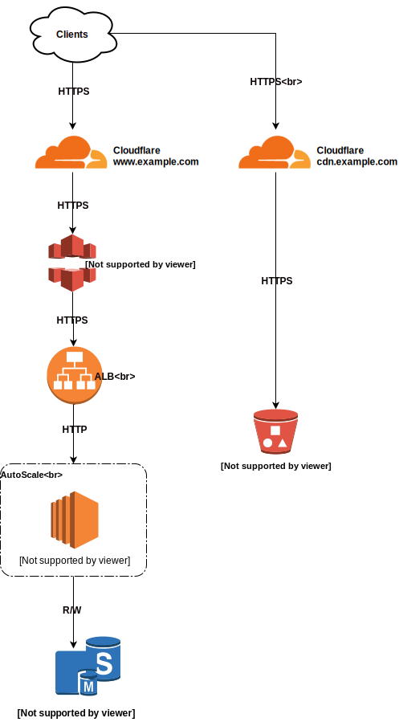

# Wordpress Ops

The right way to develop and do CI/CD for your Wordpress sites.

## Wordpress :)

"Haizz... Again :(" - this is what I (or maybe you also) say when I have to setup a Wordpress site.

Maybe you don't like `PHP` and you don't want to upgrade tons of plugins and Wordpress version every month or week (or even day). Half of your working hours are on reading bugs, vulnerabilities of Wordpress eco-system? Sometimes, you dreamed about it?

Wordpress is boring and for noobs only? Everyone can publish something, check SEO, customize the images size and quality, get a nice dashboard report, etc. Yeah, these are the main reasons why you have to set it up.

## Problems

Wordpress relies on MySQL to store data and configuration, so it is neat. Just download Wordpress release zip file, extract it somewhere and lets Apache or PHP-FPM/Nginx run that.

In general, your Wordpress development is for themes and plugins. Wordpress store all of these in `wp-content/` folder. Usually, Wordpress admin can simply click and clicks to install a new theme or plugin inside Wordpress admin panel.

There are some issues.

- Hard to replicate stuff from staging > pre-production > production. You can do the same "clicks" when you have to setup a new environment.
- Wordpress offers some config files like `wp-config.php` where you can just add the MySQL login credential and keep the file on the server. This is not manual and not a good practice also.
- You give PHP process more permission on the server which means higher risks e.g write permission to many folders like themes, plugins then you have a higher chance to get hacked because of the future bugs :)


## Solutions

- Let's use `Git`.

We only have to store `plugins` and `themes` since we only want to modify these files. Most of the time you only have to download the plugin code and add there without changing anything.

- Only give enough permission to Wordpress/PHP process in servers.

You can keep track of all public plugins and your plugins. In the server Wordpress only need read permission to all of these which is great.

- Use environment variables

Then you don't have to hardcode the MySQL password in wp-config.php. You can export necessary variables to ENV depends on your configuration management.

Note that ENV has its problem. It is not really fix the issue of plaintext password in wp-config.php. It is more about flexibility in term of configuration. E.g. you can easily swap from running Wordpress from EC2 to Docker without changing the config of where you put the secrets.

- CI/CD to rescue

Depends on the complexity of your project then you can have a different Git flow. Base on that flow you can decide how to release to staging up to production.

## Example

Imagine about a simple Wordpress site that editor publish content, upload images, etc. Readers will comment to the article using [Disqus](https://disqus.com/) basically 99% of the traffic will be static.

We use `AWS` as the infrastructure provider here. We recommend to use [Cloudflare](https://www.cloudflare.com/) as DNS manager and CDN. Cloudflare protects your site from many kinds of attacks, and it will save you a fortune when you have to serve millions of clients with TBs of bandwidth.



## Setup

I think most of the Wordpress sites are running on a single server on DigitalOcean, AWS, GCP, etc.

The problem comes when you have more than 1 instances of Wordpress e.g user sessions, uploaded data, etc. Most of these are easily handled by plugin. Here are some plugins that we recommend

- [WP Offload S3](https://deliciousbrains.com/wp-offload-s3/) uploads images to S3 instead of storing them in the server.
- [WP Session Manager](https://wordpress.org/plugins/wp-session-manager/) supports to move PHP session to database.

For fun, we will run staging and production on EC2 Ubuntu 18.04 and in development we provide a docker config with similar config.

## Development environment

Requirements 

- [Docker](https://docs.docker.com/install/) version >= v18.x
- [Docker Compose](https://docs.docker.com/compose/install/) version >= v1.3

All what you need to launch this repo in your local

```
# Update ENV variables
cp .env.sample .env

# Start MySQL and Wordpress
# Then you can access Wordpress from your browser http://localhost:8000
docker-compose up

# Turn off the resources
docker-compose down
```

## Other

- [Monitoring](./__docs__/Monitoring.md) - know your app.
- Backup
- Security
- [AWS EC2 Note](./__docs__/AWS-EC2-Note.md)

# TODO

- [ ] CI config in CircleCI or Travis.
- [ ] Ansible code to deploy on EC2.
- [ ] Terraform code to launch the whole infras set.
- [ ] Improve the Docker config and deploy to AWS ECS.


