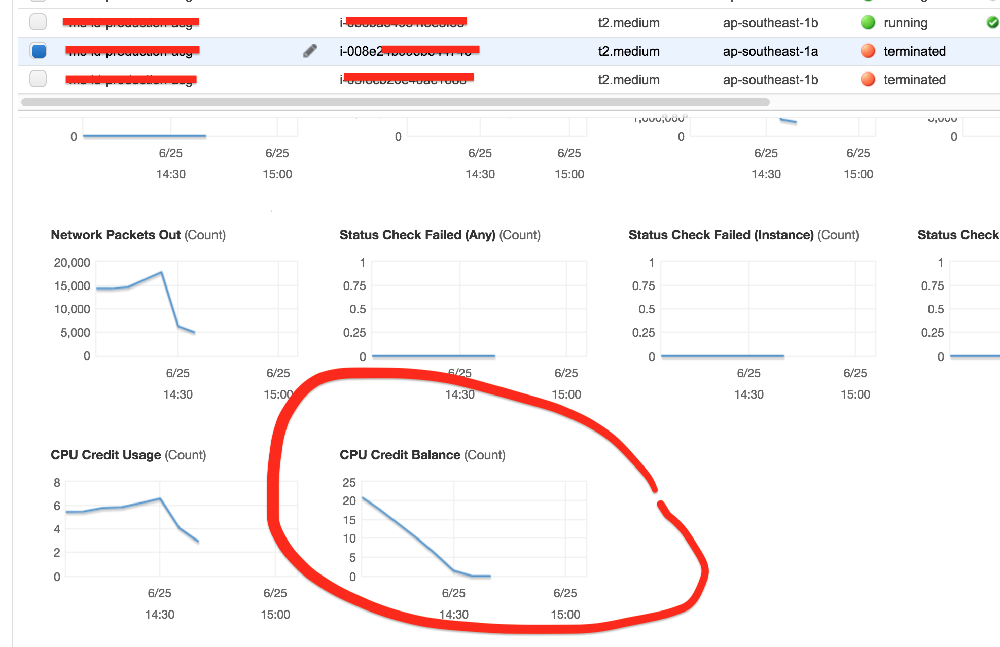

## Careful with EC2 T2 series

When your site continually receives load then better not to use [T2 Standard](https://docs.aws.amazon.com/AWSEC2/latest/UserGuide/t2-std.html) instance.

The CPU can burst above the baseline until some limit. If the traffic doesn't decrease, then it will lead to high CPU Wait then timeout will happen.

We operated a Wordpress site using `t2.medium` with autoscaling. We found that sometimes when the traffic increase 2x than normal, then autoscaling will keep replacing servers because it didn't pass the LB healthcheck. CPU Wait is super high and CPU load average is 3X CPU cores. Just because we were out of CPU credits :)

Consider to do a long stress test and use [T2 Unlimited](https://docs.aws.amazon.com/AWSEC2/latest/UserGuide/t2-unlimited.html) or other instance types like C5, M5, etc.
